### Previous Events 

## 10. 𝐇𝐚𝐜𝐤 𝐭𝐡𝐞 𝐌𝐚𝐭𝐫𝐢𝐱: 𝐍𝐞𝐭𝐰𝐨𝐫𝐤 𝐏𝐞𝐧𝐭𝐞𝐬𝐭𝐢𝐧𝐠 𝟏𝟎𝟏!🔐.
  
  
🌐 Event Recap: OWASP KARE is excited to share the incredible success of our event, 𝐇𝐚𝐜𝐤 𝐭𝐡𝐞 𝐌𝐚𝐭𝐫𝐢𝐱: 𝐍𝐞𝐭𝐰𝐨𝐫𝐤 𝐏𝐞𝐧𝐭𝐞𝐬𝐭𝐢𝐧𝐠 𝟏𝟎𝟏!

𝐄𝐯𝐞𝐧𝐭 𝐒𝐮𝐜𝐜𝐞𝐬𝐬:𝐇𝐚𝐜𝐤 𝐭𝐡𝐞 𝐌𝐚𝐭𝐫𝐢𝐱: 𝐍𝐞𝐭𝐰𝐨𝐫𝐤 𝐏𝐞𝐧𝐭𝐞𝐬𝐭𝐢𝐧𝐠 𝟏𝟎𝟏! 🎉 

On September 9, 2024, cybersecurity enthusiasts came together for an interactive online session where Mr.Hitesh Kumar Kothapalli expertly guided participants through:

👉🏻Detecting system vulnerabilities
👉🏻Exploiting weaknesses
👉🏻Strengthening security practices

The energy and engagement from everyone made this event a standout! 💻💡 We’re confident the insights gained will contribute to shaping future cybersecurity experts.

A huge appreciation to Mr.Hitesh Kumar Kothapalli and the OWASP KARE team for their dedication in making this event a success.

Stay connected for more valuable learning opportunities in the world of cybersecurity! 🔒💻

𝐄𝐯𝐞𝐧𝐭 𝐇𝐢𝐠𝐡𝐥𝐢𝐠𝐡𝐭𝐬:
Date: September 9, 2024
Time: 6:00 PM to 7:00 PM
Online 

Your participation and engagement were invaluable, and we’re grateful for the energy and insights you brought to the event. Special thanks to our incredible team who worked tirelessly to ensure everything went smoothly. 🙌

For those who missed it, stay tuned for more exciting events and updates by joining our community on WhatsApp and follow us for future events!

Thank you once again to everyone involved. We look forward to seeing you at our next event! 🔐

  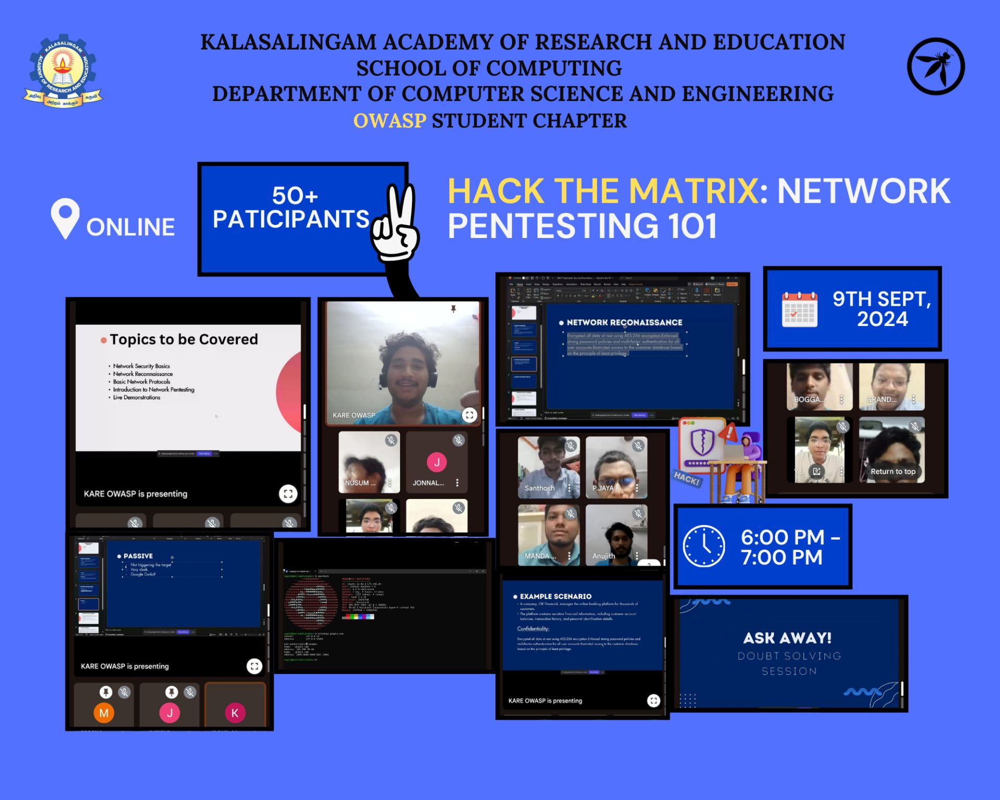

<!-- 

  

 -->

## 9. 𝐂𝐨𝐝𝐞𝐁𝐫𝐞𝐚𝐜𝐡 𝐁𝐚𝐭𝐭𝐥𝐞 - 𝐊𝐧𝐨𝐰𝐥𝐞𝐝𝐠𝐞 𝐊𝐧𝐨𝐜𝐤𝐨𝐮𝐭 🎉.
  
  
🌐 Event Recap: 𝐑𝐨𝐮𝐧𝐝 𝟏 𝐒𝐮𝐜𝐜𝐞𝐬𝐬: 𝐂𝐨𝐝𝐞𝐁𝐫𝐞𝐚𝐜𝐡 𝐁𝐚𝐭𝐭𝐥𝐞 - 𝐊𝐧𝐨𝐰𝐥𝐞𝐝𝐠𝐞 𝐊𝐧𝐨𝐜𝐤𝐨𝐮𝐭 🔐

𝐄𝐯𝐞𝐧𝐭 𝐒𝐮𝐜𝐜𝐞𝐬𝐬:𝐂𝐨𝐝𝐞𝐁𝐫𝐞𝐚𝐜𝐡 𝐁𝐚𝐭𝐭𝐥𝐞 - 𝐊𝐧𝐨𝐰𝐥𝐞𝐝𝐠𝐞 𝐊𝐧𝐨𝐜𝐤𝐨𝐮𝐭 .🎉 

OWASP KARE is happy to announce the successful completion of 𝐑𝐨𝐮𝐧𝐝 𝟏
of the 𝐂𝐨𝐝𝐞𝐁𝐫𝐞𝐚𝐜𝐡 𝐁𝐚𝐭𝐭𝐥𝐞: 𝐊𝐧𝐨𝐰𝐥𝐞𝐝𝐠𝐞 𝐊𝐧𝐨𝐜𝐤𝐨𝐮𝐭 held on August 21, 2024! 🏆🖥️

A huge thank you to everyone who participated and made this event a grand success. Your enthusiasm and expertise in cybersecurity truly shone through!

𝐄𝐯𝐞𝐧𝐭 𝐇𝐢𝐠𝐡𝐥𝐢𝐠𝐡𝐭𝐬:
Date: August 21, 2024
Time: 5:00 PM to 6:00 PM
Venue: 8003
Round 1: Knowledge Knockout

Our quiz covered a range of exciting topics, including:
-Linux basics
-Cybersecurity tools
-Cryptography
-Web Application Security
-Cloud Security
-IoT Security
...and more!

Your participation and engagement were invaluable, and we’re grateful for the energy and insights you brought to the event. Special thanks to our incredible team who worked tirelessly to ensure everything went smoothly. 🙌

For those who missed it, stay tuned for more exciting events and updates by joining our community on WhatsApp and follow us for future events!

Thank you once again to everyone involved. We look forward to seeing you at our next event! 🔐

  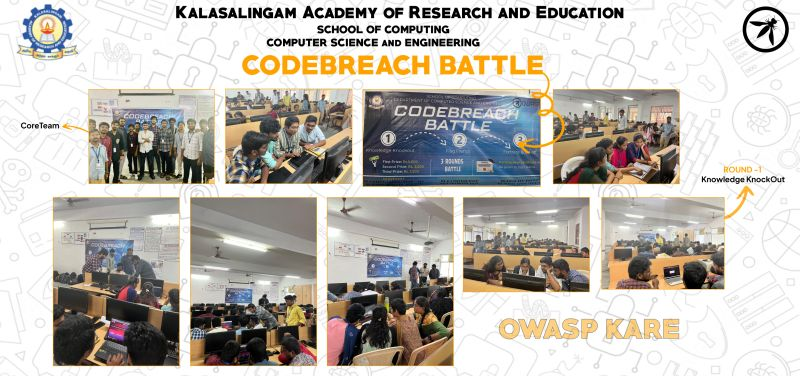

  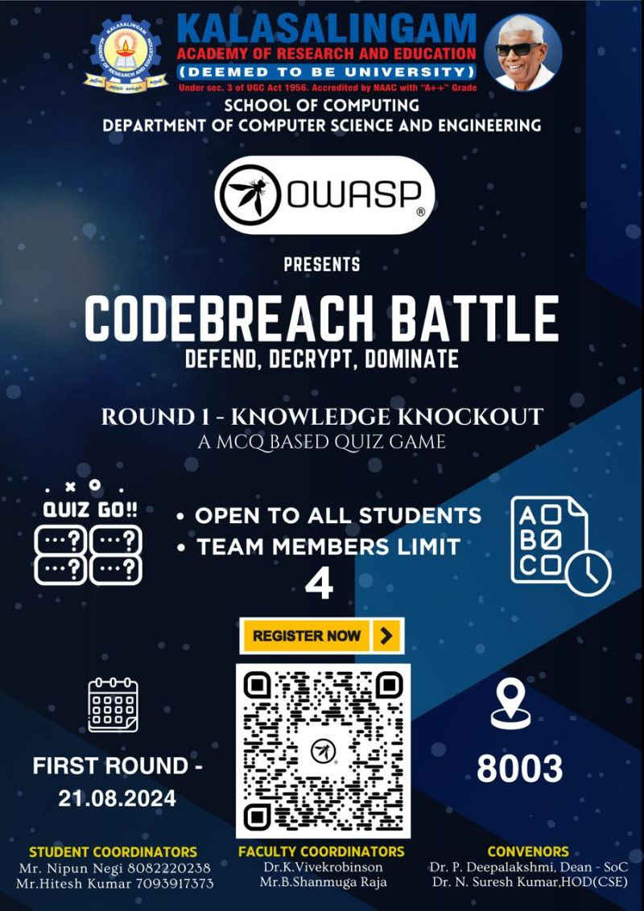

## 8. Cloud Fortress - An Introduction to Cloud Security by Sanjeev Jaiswal.
  
  
🌐 Event Recap: Successful Cyber Security Webinar 🔐

𝐄𝐯𝐞𝐧𝐭 𝐒𝐮𝐜𝐜𝐞𝐬𝐬: 𝐂𝐥𝐨𝐮𝐝 𝐅𝐨𝐫𝐭𝐫𝐞𝐬𝐬 - 𝐀𝐧 𝐈𝐧𝐭𝐫𝐨𝐝𝐮𝐜𝐭𝐢𝐨𝐧 𝐭𝐨 𝐂𝐥𝐨𝐮𝐝 𝐒𝐞𝐜𝐮𝐫𝐢𝐭𝐲.🎉 

OWASP KARE is excited to share we have hosted a successful and enlightening session on "Cloud Fortress: An Introduction to Cloud Security" on August 13th, 2024! The event featured a compelling talk by industry expert Sanjeev Kumar Jaiswal, who provided invaluable insights into the critical aspects of cloud security and security architecture.

We were honored to host Sanjeev Kumar, an industry expert who delivered an insightful session covering global cloud security market trends, the importance of cloud security, and various AWS security services and tools.

A huge thank you to Sanjeev Kumar for sharing his expertise and to everyone who joined us online. Your participation and enthusiasm contributed to making this event a resounding success!

Stay tuned for more exciting events from OWASP KARE as we continue to explore and advance in the world of cybersecurity! 🔐

  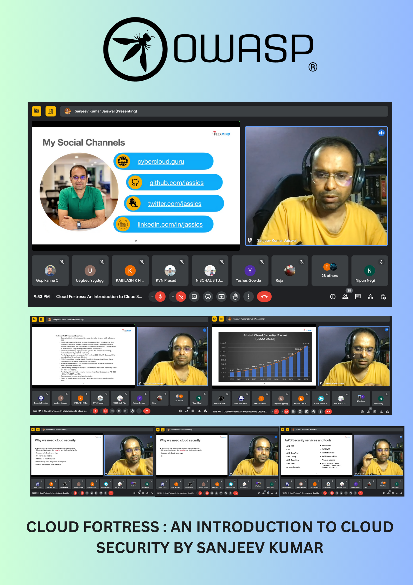

  

## 7. Getting into CyberSecurity by Grant Ongers.
  
  
🌐 Event Recap: Successful Cyber Security Webinar 🔐

We are thrilled to share the success of our recent webinar on Cyber Security, which was conducted smoothly thanks to our esteemed speaker, Grant Ongers.

Grant's insightful presentation provided invaluable knowledge and practical advice on the latest trends and best practices in cyber security. The webinar concluded with an engaging Q&A session, where our participants had the opportunity to ask pressing questions and receive expert guidance.

A heartfelt thank you to all our participants for their active involvement and enthusiasm. Your participation made this event truly special.

Stay tuned for more exciting events and opportunities to enhance your cyber security skills!

Event Details:
 Date: 01st August , 2024 Time: 8:30 PM
 Speaker:Grant Ongers, Founder Secure Delivery

  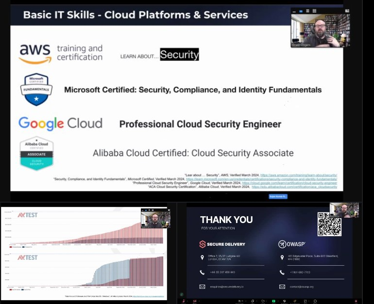

  

## 6. Cybersecurity Careers in the AI Era: Your Guide to Getting Started in Cybersecurity.
  
  

Join us to explore the dynamic field of cybersecurity and learn how AI is transforming the industry. Whether you're just starting out or looking to advance your career, this event is packed with insights and guidance to help you navigate your path in cybersecurity. Don't miss this opportunity to gain valuable knowledge from an industry expert!

Event Details:
 Date: 19th June, 2024 Time: 8:30 PM
 Speaker:Prashasth Baliga , Cyber Security Manager at Palo Alto Labs
 

  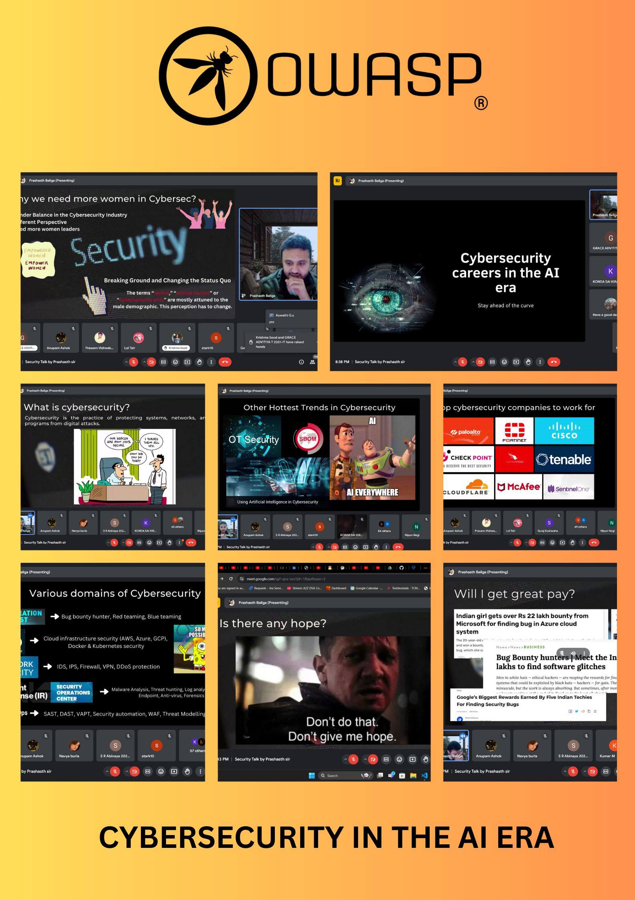

  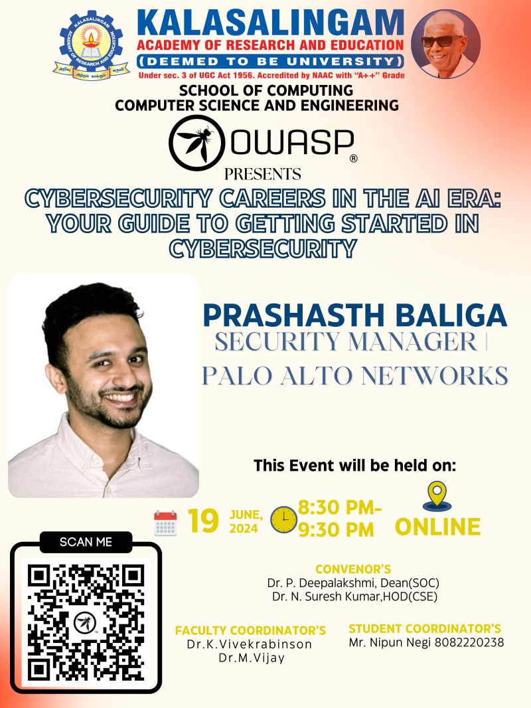

## 5. Online Webinar on OSINT (Open Source Intelligence)
  
Join Us for an Exclusive OSINT Workshop at OWASP KARE!
We're excited to invite students and security enthusiasts to a unique Workshop on Open Source Intelligence (OSINT).
Learn how to gather, analyze, and utilize publicly available information in cybersecurity contexts.
Date: 31st May 2024
• Time: 12:00 PM
Speaker: Nipun Negi (President, OWASP KARE)
 Why Attend?
  * Hands-On Training
  * Real-World Scenarios
 
Email: nipun.negi@owasp.org

Don't miss this chance to enhance your cybersecurity skills and network with professionals! Scan the QR code to register now and secure your spot!

  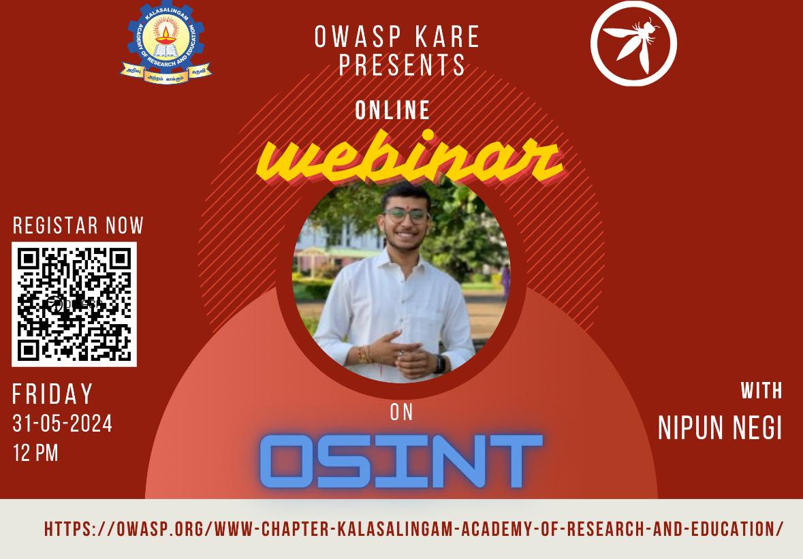

## 4. Winners of SecureNet Riddle Rally 
  
  
Congratulations on 𝐒𝐞𝐜𝐮𝐫𝐞𝐍𝐞𝐭 𝐑𝐢𝐝𝐝𝐥𝐞 𝐑𝐚𝐥𝐥𝐲 Success!

Kudos to the winners of the SecureNet Riddle Rally held on 𝐌𝐚𝐲 𝟏𝟓𝐭𝐡, 𝟐𝟎𝟐𝟒! With over #130 students participating, the event showcased remarkable engagement and enthusiasm. Thank you to all who contributed, and let's keep the cybersecurity momentum going strong!

  
  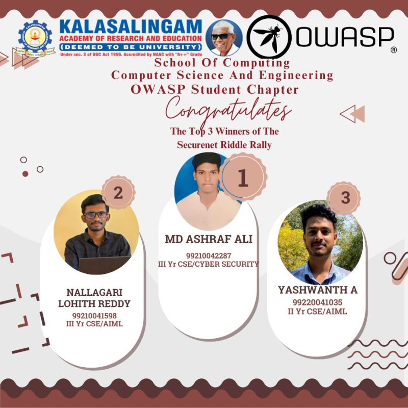
  

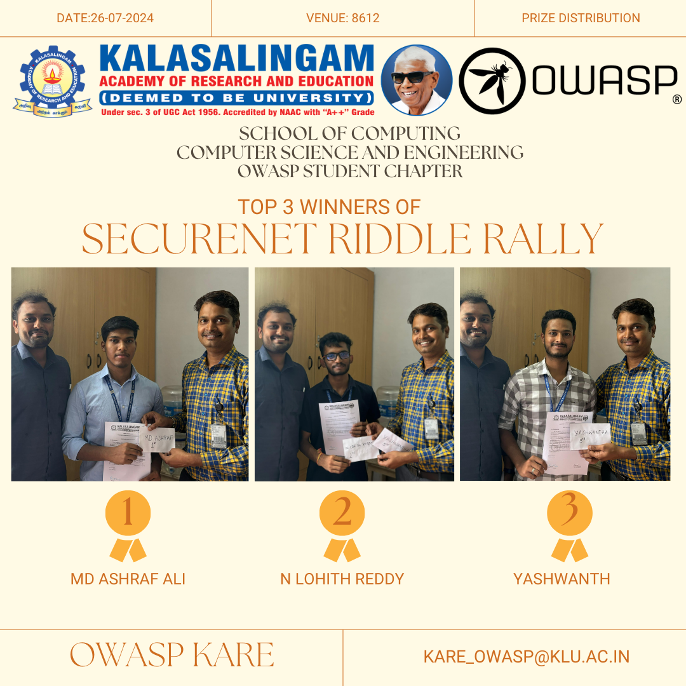

## 3. SecureNet Riddle Rally 
  
  
  Dear Students,

Join us for the SecureNet Riddle Rally, an exciting quiz competition designed to test your knowledge, skills, and understanding of cybersecurity concepts in a fun and engaging way. Navigate through a series of questions covering network security, data protection, encryption, cyber threats, and more!

📅 Date: 15.05.2024
🕛 Time: 12:00 PM - 1:00 PM
🌐 Mode of Conduct: Online

𝐏𝐫𝐢𝐳𝐞𝐬:
 1st Place: ₹ 1000 
 2nd Place: ₹ 750 
 3rd Place: ₹ 500

  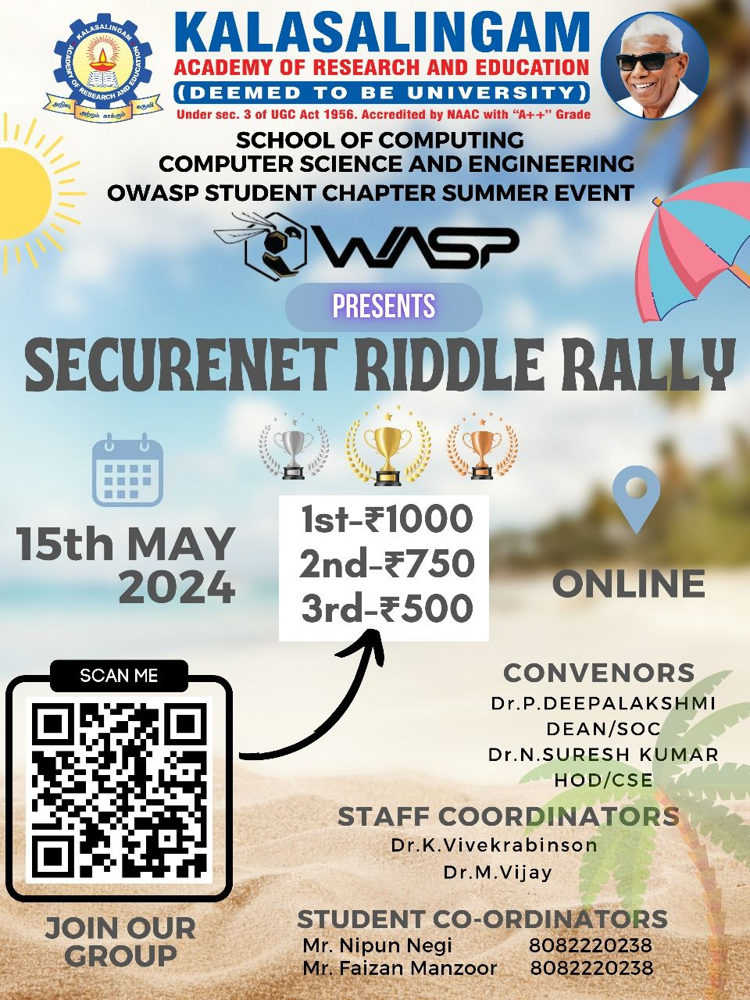

## 2. Introduction to the OWASP PSCF(27th Feb , 2024) 
  Speaker : Grant Ongers
  
  Topic : OWASP PSCF
  
  Total Attendees: 175
  
  Time : 5:00PM - 6:00PM
  
  Venue : Library Conference HALL , KARE

  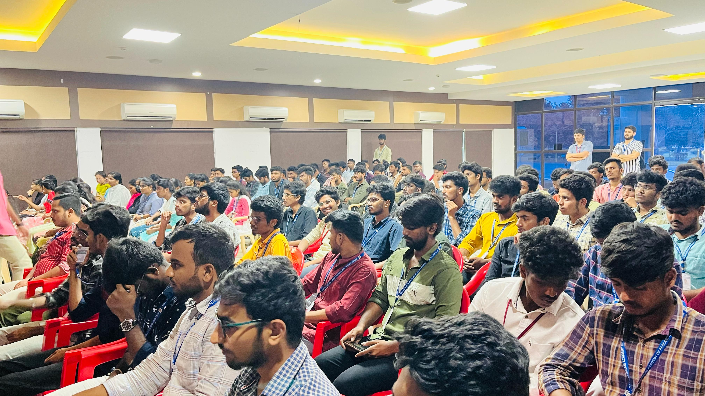

  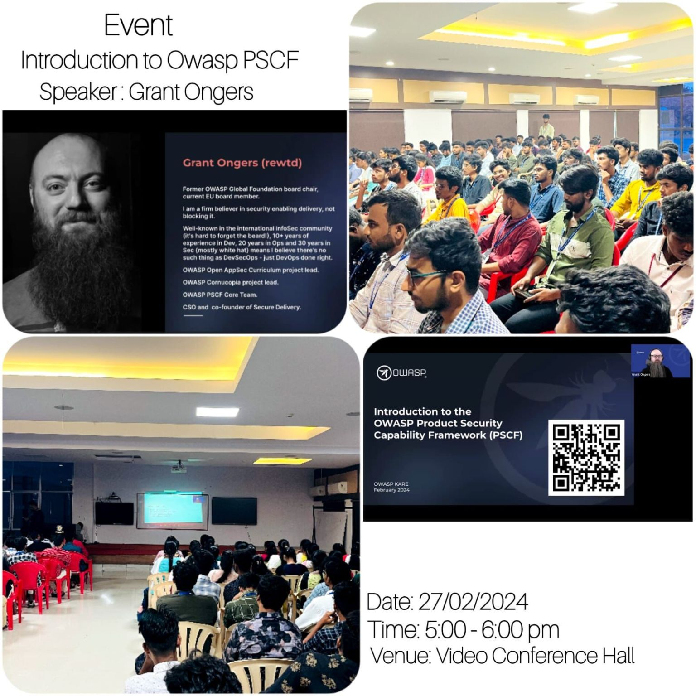

## 1. Chapter Inaugration (31st Jan , 2024) 
The chapter was inaugrated in the presence of Mohsin Quresh(Cyber Security SME for IBM) and various office bearers of Kalasalingam Academy of Research and Education. [A short video from our inaugration
](https://www.linkedin.com/feed/update/urn:li:activity:7160658288185909249).

  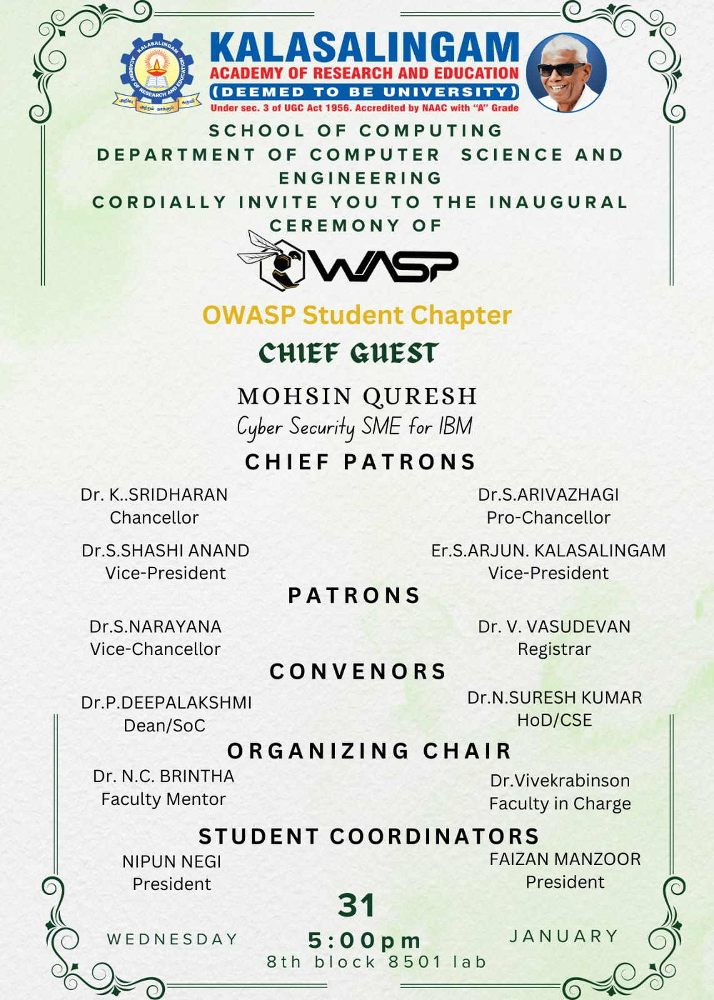

