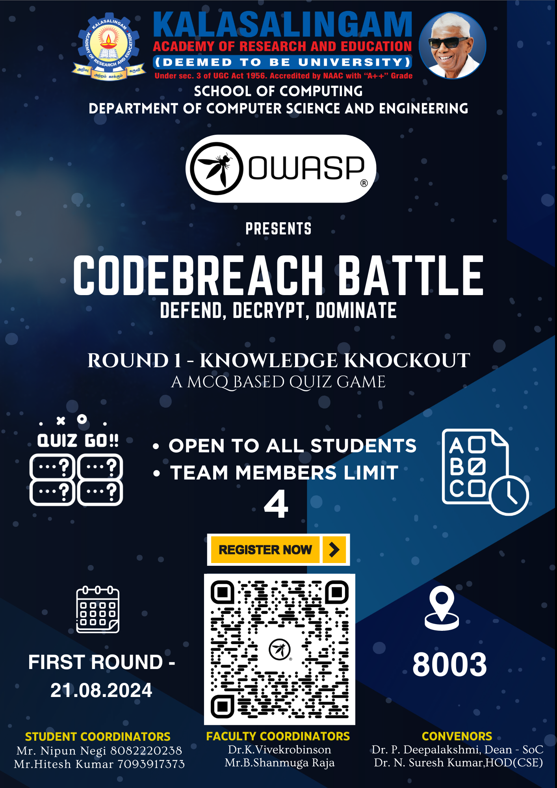

### Upcoming Events / Registrations are open 

## 1. 𝐂𝐨𝐝𝐞𝐁𝐫𝐞𝐚𝐜𝐡 𝐁𝐚𝐭𝐭𝐥𝐞: 𝐊𝐧𝐨𝐰𝐥𝐞𝐝𝐠𝐞 𝐊𝐧𝐨𝐜𝐤𝐨𝐮𝐭🛡️🔍
Prepare to elevate your cybersecurity skills to the next level! 

Join OWASP KARE for the 𝐂𝐨𝐝𝐞𝐁𝐫𝐞𝐚𝐜𝐡 𝐁𝐚𝐭𝐭𝐥𝐞: 𝐊𝐧𝐨𝐰𝐥𝐞𝐝𝐠𝐞 𝐊𝐧𝐨𝐜𝐤𝐨𝐮𝐭🛡️🔍 – an exciting quiz competition designed to challenge and enhance your cybersecurity expertise!

📅 Date: August 21, 2024
⏰ Time: 5:00 PM - 6:00 PM
📍 Venue: Room 8003, KARE

🚀 Why participate?
Tackle topics like Linux, Cryptography, Web Application Security, and more!
Showcase your skills and rise to the top.
Compete with fellow students and see who can dominate the quiz.

👥 Who can join?
Open to all students who are passionate about cybersecurity! Team up with three friends (teams of 4) and dive into the action.

🔗 Secure your spot: https://lnkd.in/gSdsCHYh
💬 Stay updated: https://lnkd.in/gfjbzmbe

Don't miss this chance to defend, decrypt, and dominate with OWASP KARE! 

  

  

